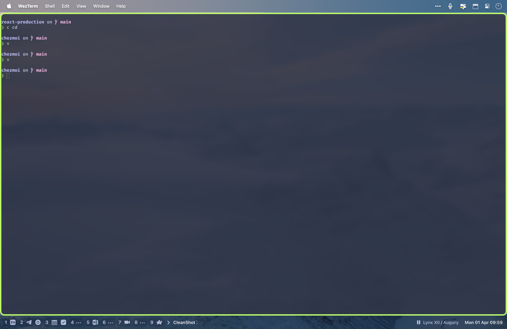
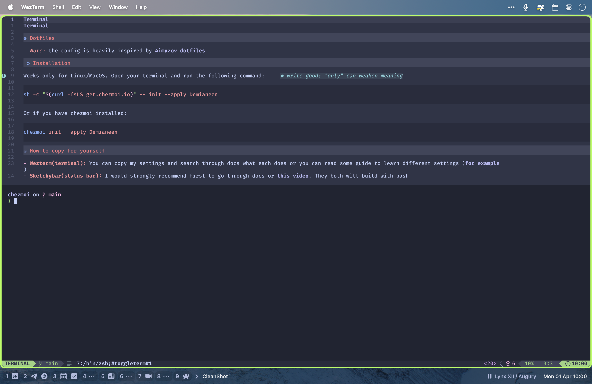

# Dotfiles

> _Note:_ the config is heavily inspired by [Aimuzov dotfiles](https://github.com/aimuzov/dotfiles)

## Installation

Works only for Linux/MacOS. Open your terminal and run the following command:

```bash
sh -c "$(curl -fsLS get.chezmoi.io)" -- init --apply Demianeen
```

Or if you have chezmoi installed:

```bash
chezmoi init --apply Demianeen
```

# How to copy for yourself

- **Wezterm(terminal):** You can copy my settings and search through docs what each does or you can read some guide to learn different settings ([for example](https://hackernoon.com/get-the-most-out-of-your-terminal-a-comprehensive-guide-to-wezterm-configuration))
- **Sketchybar(status bar):** I would strongly recommend first to go through docs or [this video](https://youtu.be/8W06wMNZmo8?si=d5i3RdlqL7ozGRuw). They both will build with bash instead of lua (which I use). But the way you configure it and options are identical
- **Sketchy vim(vim inputs throughout MacOS):** Follow the installation guide in [official repo](https://github.com/FelixKratz/SketchyVim). There is not a lot to do
- **Yabai/skhd(window manager/hotkeys):** I would recommend to go
  through docs or [this video](https://youtu.be/k94qImbFKWE?si=-RgiTdDujb6872e5) first, before diving into config.
- **Janky Borders(green borders on screen above):** You can follow docs
  [installation guide](https://github.com/FelixKratz/JankyBorders#usage). There is not a lot to do

P.S. To enable full Nvim MacOS experience I also recommend to try Homerow.

## FAQ

### How much time did I spend configuring dotfiles

Near 200 hours across 3-4 month.

### Was it worth it? Should I do this too?

For me? Yeah. For you, it depends.

Will I get all the time I spend configuring this back? Probably not.
Neovim and tools do speed up my workflow, but it probably would be years before
I would start get the return on investment on all the time I spend on
configuring Neovim and other tools. But you know what? I did get something else
during the process creating it:

1. **CLI:** I was getting used to CLI for
   a while, but during configuring Neovim I learned a lot about CLI, which is
   skills that now I use every day.
2. **Learning how editor works under the hood:**
3. **Exposure to Open Source Community:** I was always a little afraid of open
   source. I mean I can open the repo README, but I usually read it a little
   and went to search for another guide on Google.
   With Neovim I didn't have much choice but to go to github repo and properly read the
   docs, ask community and sometimes read the source code and maybe make a Pull
   request or two to fix the issue I have. I also learned way better how to report
   issues I have and how to interact with other devs. I even viewed the repos of Typescript,
   Python, React. Which I didn't know even existed to be fair.
4. Git and commit lint
5. Lua and bash
6. Other dev tools like asdf
